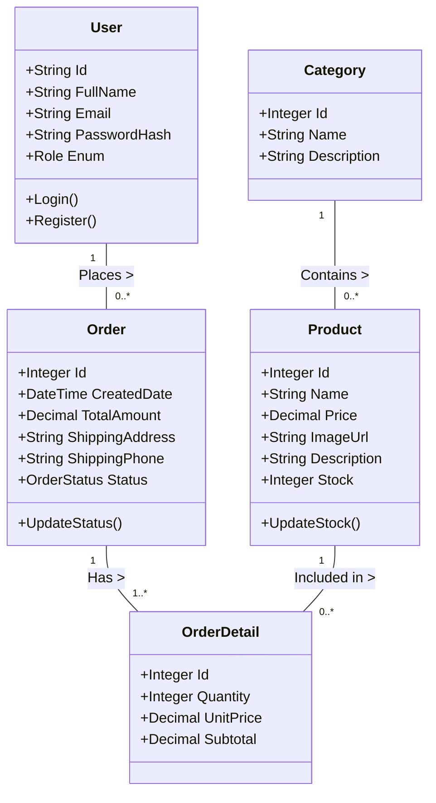
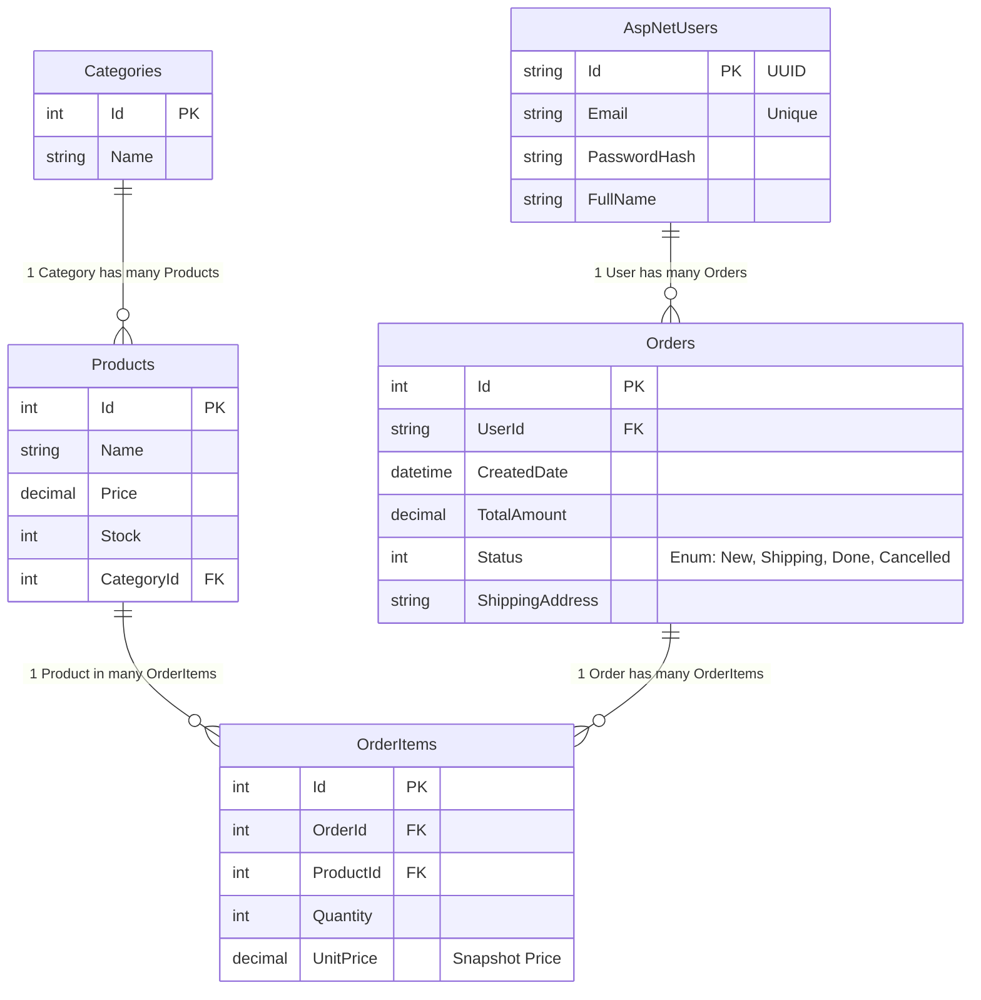

# 🔍 PHÂN TÍCH HỆ THỐNG DNU SHOP (COMPLETE GUIDE)

## 1. Phát biểu bài toán (Detailed Scenario)

*Dưới đây là mô tả chi tiết về hoạt động của hệ thống, được dùng làm đầu vào duy nhất cho quá trình phân tích.*

**"Hệ thống DNU Shop là một nền tảng thương mại điện tử chuyên cung cấp các thiết bị công nghệ. Hệ thống có 2 nhóm người dùng chính: Khách hàng (Customer) và Quản trị viên (Admin). Tất cả người dùng đều có thông tin cơ bản gồm Họ tên, Email (duy nhất) và Mật khẩu (đã được mã hóa).**

**Đối với SẢN PHẨM (Product): Mỗi sản phẩm được bày bán đều thuộc về một Danh mục (Category) cụ thể (ví dụ: Điện thoại, Laptop). Sản phẩm cần lưu trữ các thông tin chi tiết gồm: Tên sản phẩm, Giá bán hiện tại, Hình ảnh minh họa, Mô tả kỹ thuật và Số lượng tồn kho. Một danh mục có thể chứa nhiều sản phẩm, nhưng mỗi sản phẩm chỉ thuộc một danh mục.**

**Quy trình MUA HÀNG (Ordering): Khách hàng sau khi đăng nhập có thể chọn mua nhiều sản phẩm. Khi khách hàng quyết định 'Đặt hàng', hệ thống sẽ tạo ra một Đơn hàng (Order). Một Đơn hàng phải chứa thông tin về: Ngày đặt hàng, Tổng tiền thanh toán, Tên người nhận, SĐT người nhận và Địa chỉ giao hàng. Đặc biệt, một đơn hàng bao gồm nhiều dòng sản phẩm, mỗi dòng được gọi là Chi tiết đơn hàng (OrderDetail). Mỗi Chi tiết đơn hàng ghi nhận lại Sản phẩm nào được mua, Số lượng bao nhiêu và Giá bán tại thời điểm mua (để lưu vết lịch sử giá nếu giá gốc thay đổi).**

**Quy trình QUẢN LÝ (Management): Quản trị viên cần theo dõi trạng thái của Đơn hàng. Một đơn hàng sẽ có các trạng thái chuyển đổi tuần tự: Mới (New) -> Đang giao (Shipping) -> Hoàn thành (Completed) hoặc bị Hủy (Cancelled). Quản trị viên cũng quản lý kho hàng bằng cách cập nhật Số lượng tồn kho của sản phẩm."**

---

## 2. Phương pháp Phân tích (Analysis Methodology)

Quy trình chuyển đổi từ **Scenario** sang **Thiết kế** gồm 3 bước:

1.  **Phân tích Danh từ (Noun Analysis)** $\to$ Xác định **Entities** (Thực thể) và **Attributes** (Thuộc tính).
2.  **Phân tích Động từ (Verb Analysis)** $\to$ Xác định **Relationships** (Quan hệ) và **Methods** (Phương thức).
3.  **Mô hình hóa (Modeling)** $\to$ Vẽ **Class Diagram** và **ERD**.

### 2.1. Bước 1: Phân tích Danh từ (Noun Analysis)

*Liệt kê TOÀN BỘ danh từ xuất hiện trong Scenario và phân loại.*

| Danh từ (Trong văn bản) | Phân loại | Giải thích / Ánh xạ |
| :--- | :--- | :--- |
| **Hệ thống DNU Shop** | Bỏ qua | Phạm vi hệ thống, không phải đối tượng dữ liệu. |
| **Khách hàng (Customer)** | `Role` / `User` | Là một loại người dùng. Ánh xạ vào entity **User** (với Role='Customer'). |
| **Quản trị viên (Admin)** | `Role` / `User` | Là một loại người dùng. Ánh xạ vào entity **User** (với Role='Admin'). |
| **Người dùng** | **Entity** | Thực thể cha, quản lý thông tin đăng nhập chung. $\to$ Table `AspNetUsers` |
| **Họ tên, Email, Mật khẩu** | **Attribute** | Thuộc tính của `User`. |
| **Sản phẩm (Product)** | **Entity** | Đối tượng hàng hóa. $\to$ Table `Products` |
| **Danh mục (Category)** | **Entity** | Đối tượng phân loại. $\to$ Table `Categories` |
| **Tên SP, Giá, Hình ảnh, Mô tả, Tồn kho** | **Attribute** | Thuộc tính của `Product`. |
| **Đơn hàng (Order)** | **Entity** | Đối tượng giao dịch chính. $\to$ Table `Orders` |
| **Ngày đặt, Tổng tiền** | **Attribute** | Thuộc tính của `Order`. |
| **Tên người nhận, SĐT, Địa chỉ** | **Attribute** | Thuộc tính của `Order` (Thông tin giao hàng). |
| **Chi tiết đơn hàng (OrderDetail)** | **Entity** | Đối tượng trung gian (Order-Product). $\to$ Table `OrderItems` |
| **Số lượng (mua)** | **Attribute** | Thuộc tính của `OrderDetail`. |
| **Giá bán (tại thời điểm mua)** | **Attribute** | Thuộc tính của `OrderDetail` (Lưu ý: Khác với giá hiện tại của SP). |
| **Trạng thái (Status)** | **Attribute** | Thuộc tính của `Order` (New, Shipping... ). |

**👉 KẾT QUẢ BƯỚC 1: Danh sách Thực thể (Entities)**
1.  **User** (Người dùng)
2.  **Product** (Sản phẩm)
3.  **Category** (Danh mục)
4.  **Order** (Đơn hàng)
5.  **OrderDetail** (Chi tiết đơn hàng)

---

### 2.2. Bước 2: Phân tích Động từ (Verb Analysis)

*Xác định mối quan hệ giữa các thực thể dựa trên hành động.*

| Động từ / Mối quan hệ | Phân tích quan hệ (Cardinality) | Phương thức (Methods) |
| :--- | :--- | :--- |
| Sản phẩm **thuộc về** Danh mục | **Category (1) -- (n) Product**   *(1 Danh mục có nhiều SP, 1 SP thuộc 1 Danh mục)* | `GetProductsByCategory(cateId)` |
| Khách hàng **quyết định / tạo** Đơn hàng | **User (1) -- (n) Order**   *(1 Khách có nhiều đơn, 1 Đơn thuộc 1 Khách)* | `CreateOrder(userId, cartData)` |
| Đơn hàng **bao gồm** Chi tiết | **Order (1) -- (n) OrderDetail**   *(1 Đơn có nhiều dòng chi tiết)* | `GetOrderDetails(orderId)` |
| Chi tiết **ghi nhận** Sản phẩm | **Product (1) -- (n) OrderDetail**   *(1 SP xuất hiện trong nhiều đơn khác nhau)* | `GetProductSalesHistory(productId)` |
| Quản trị viên **cập nhật** Tồn kho | Tác động lên thuộc tính `Stock` của Product | `UpdateStock(productId, newQuantity)` |
| Quản trị viên **chuyển trạng thái** Đơn hàng | Tác động lên thuộc tính `Status` của Order | `UpdateOrderStatus(orderId, newStatus)` |

---

## 3. Thiết kế Hệ thống (System Design)

### 3.1. Biểu đồ Lớp (Class Diagram)

*Biểu đồ này được suy ra TRỰC TIẾP từ kết quả phân tích Danh từ (Entities/Attributes) và Động từ (Relationships/Methods) ở trên.*

### 3.2. Lược đồ Cơ sở dữ liệu (Database Schema)

*Chuyển đổi từ Class Diagram sang ERD (Entity Relationship Diagram) vật lý.
Lưu ý: Bảng `User` sẽ mapping với `AspNetUsers` của Identity Framework.*

## 4. Tổng kết

Quy trình phân tích từ văn bản đến thiết kế CSDL đã hoàn tất:
1.  **Input**: Scenario chi tiết (Mục 1).
2.  **Analysis**: Bảng Danh từ & Động từ (Mục 2).
3.  **Output**: Class Diagram & ERD (Mục 3).

Các bước tiếp theo (Coding) sẽ bám sát vào các model này để đảm bảo đúng yêu cầu nghiệp vụ.
